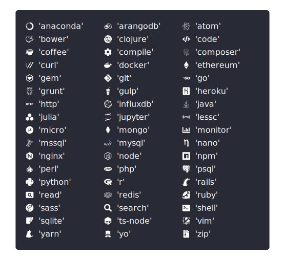

# cli-screencast

[](https://github.com/luciancooper/cli-screencast/actions/workflows/ci.yml)
[](https://codecov.io/gh/luciancooper/cli-screencast)
[](#license)

## About

An easy to use Node.js API for rendering terminal screenshots and recordings to animated svg or png.

## Installation

Install with `npm`:

```bash
npm install cli-screencast
```

Or with `yarn`:

```bash
yarn add cli-screencast
```

## API

All methods accept an `options` object as the last argument. Options common to all methods are listed in the [options](#options) section below.

All methods are asynchronous and return a `string` or `Buffer` depending on the output format specified by the [`output`](#options.output) option. If `output` is `'svg'`, the method will return an svg image `string`. If `output` is `'png'`, the method will return a png image `Buffer`.

### `renderScreen(content, options)`

Render a single terminal frame to svg or png.

> #### *Arguments:*

› &nbsp; **content** &nbsp;•&nbsp; `string`

Screen content to render

› &nbsp; **options** &nbsp;•&nbsp; `Object`

Options config object to specify [configuration options](#options).

### `renderFrames(frames, options)`

Render an animated terminal screen capture from an array of content frames.

> #### *Arguments:*

› &nbsp; **frames** &nbsp;•&nbsp; `Object[]`

Array of content frames in the form of `{ content: string, duration: number }`.

› &nbsp; **options** &nbsp;•&nbsp; `Object`

Options config object to specify [configuration options](#options).

### `renderSpawn(command, args, options)`

Record and render the terminal output of a spawned sub process. Signature mimics that of [`child_process.spawn`](https://nodejs.org/api/child_process.html#child_process_child_process_spawn_command_args_options).

> #### *Arguments:*

› &nbsp; **command** &nbsp;•&nbsp; `string`

The command to run.

› &nbsp; **args** &nbsp;•&nbsp; `string[]`

List of string arguments.

› &nbsp; **options** &nbsp;•&nbsp; `Object`

Options config object to specify [configuration options](#options) as well as the additional options listed below.

> #### *Additional Options:*

<a name='options.term'></a>
› &nbsp; **term** &nbsp;•&nbsp; `string`

Name of the terminal to be set in environment (`$TERM` variable). Default is `'xterm'`.

<a name='options.cwd'></a>
› &nbsp; **cwd** &nbsp;•&nbsp; `string`

Working directory to be set for the child process. Default is `process.cwd()`.

<a name='options.env'></a>
› &nbsp; **env** &nbsp;•&nbsp; `Object`

Environment key-value pairs to be set for the child process. Automatically extends from `process.env`, which can be changed by setting `extendEnv` to `false`. Default is `undefined`.

<a name='options.extendEnv'></a>
› &nbsp; **extendEnv** &nbsp;•&nbsp; `boolean`

The child process environment extends from `process.env`. Defaults to `true`.

<a name='options.timeout'></a>
› &nbsp; **timeout** &nbsp;•&nbsp; `number`

The maximum amount of time the process is allowed to run in milliseconds. If greater than `0`, the spawned process will be killed if it runs longer than the timeout milliseconds. Default is `0`.

<a name='options.killSignal'></a>
› &nbsp; **killSignal** &nbsp;•&nbsp; `string`

The signal to be used when the spawned process is killed by `timeout`. Default is `'SIGTERM'`.

### `renderCapture(fn, options)`

Capture and render all terminal output that occurs within a callback function.

> #### *Arguments:*

› &nbsp; **fn** &nbsp;•&nbsp; `(source) => void`

Callback function within which terminal output is captured. Can be synchronous or asynchronous. The callback function will be passed a `TerminalRecordingStream` instance.

**Note:** Within the scope of this function, all writes to `process.stdout` and `process.stderr`, (and by extension calls to `console.log` and `console.error`) will be captured.

› &nbsp; **options** &nbsp;•&nbsp; `Object`

Options config object to specify [configuration options](#options) as well as the additional options listed below.

> #### *Additional Options:*

<a name='options.connectStdin'></a>
› &nbsp; **connectStdin** &nbsp;•&nbsp; `boolean`

Connect capture session to `process.stdin` to capture any input from the user. Defaults to `false`.

<a name='options.silent'></a>
› &nbsp; **silent** &nbsp;•&nbsp; `boolean`

Silently capture output to `process.stdout` and `process.stderr`. Defaults to `true`.

## Options

<a name='options.logLevel'></a>
› &nbsp; **logLevel** &nbsp;•&nbsp; `string`

Controls how much info is logged to the console during the render process. Options are (in order of descending verbosity): `'debug'`, `'info'`, `'warn'`, `'error'`, and `'silent'`. Defaults to `'info'`.

> ### *Output Related Options*

<a name='options.output'></a>
› &nbsp; **output** &nbsp;•&nbsp; `string`

The desired output format. Must be either `'svg'` or `'png'`. The default is `'svg'`.

<a name='options.scaleFactor'></a>
› &nbsp; **scaleFactor** &nbsp;•&nbsp; `number`

The device scale factor used when rendering to png. Default is `4`.

**Note:** This option is only applicable when `output` is `'png'`.

<a name='options.embedFonts'></a>
› &nbsp; **embedFonts** &nbsp;•&nbsp; `boolean`

Embed required fonts when rendering to svg, Defaults to `true`.

**Note:** This option is only applicable when `output` is `'svg'`.

> ### *Capture Related Options*

<a name='options.writeMergeThreshold'></a>
› &nbsp; **writeMergeThreshold** &nbsp;•&nbsp; `number`

Consecutive writes will be merged if they occur within this number of milliseconds of each other. Default is `80`.

<a name='options.endTimePadding'></a>
› &nbsp; **endTimePadding** &nbsp;•&nbsp; `number`

Milliseconds to add to the end of a captured terminal recording. Default is `500`.

<a name='options.cropStartDelay'></a>
› &nbsp; **cropStartDelay** &nbsp;•&nbsp; `boolean`

Remove the time difference between the start of the capture and the first write when capturing a terminal recording. Defaults to `true`.

<a name='options.captureCommand'></a>
› &nbsp; **captureCommand** &nbsp;•&nbsp; `boolean`

Include a prompt and command string at the beginning of a captured recording, if the recording was started with a command. Defaults to `true`.

<a name='options.prompt'></a>
› &nbsp; **prompt** &nbsp;•&nbsp; `string`

The prompt prefix string to use when a command is captured. Default is `'> '`.

**Note:** This option is only applicable when `captureCommand` is `true`.

<a name='options.keystrokeAnimation'></a>
› &nbsp; **keystrokeAnimation** &nbsp;•&nbsp; `boolean`

Include a command input keystroke animation at the start of the recording if command prompt line is captured. Defaults to `true`.

**Note:** This option is only applicable when `captureCommand` is `true`.

<a name='options.keystrokeAnimationInterval'></a>
› &nbsp; **keystrokeAnimationInterval** &nbsp;•&nbsp; `number`

The delay in milliseconds between keystrokes to use when creating a command input animation. Default is `140`.

**Note:** This option is only applicable when `keystrokeAnimation` is `true`.

> ### *Rendering Related Options*

<a name='options.columns'></a>
› &nbsp; **columns** &nbsp;•&nbsp; `number` &nbsp;•&nbsp; **Required**

The column width of the captured terminal window.

<a name='options.rows'></a>
› &nbsp; **rows** &nbsp;•&nbsp; `number` &nbsp;•&nbsp; **Required**

The row height of the captured terminal window.

<a name='options.tabSize'></a>
› &nbsp; **tabSize** &nbsp;•&nbsp; `number`

Tab column width. Defaults to `8`.

<a name='options.cursorHidden'></a>
› &nbsp; **cursorHidden** &nbsp;•&nbsp; `boolean`

Cursor is hidden in the captured terminal recording or frame. Defaults to `false`.

<a name='options.fontSize'></a>
› &nbsp; **fontSize** &nbsp;•&nbsp; `number`

The font size of the rendered terminal output. Default is `16`.

<a name='options.lineHeight'></a>
› &nbsp; **lineHeight** &nbsp;•&nbsp; `number`

The line height of the rendered terminal output. Default is `1.25`.

<a name='options.theme'></a>
› &nbsp; **theme** &nbsp;•&nbsp; `Object`

Terminal theme specification object. See the [themes](#theme) section below.

<a name='options.windowTitle'></a>
› &nbsp; **windowTitle** &nbsp;•&nbsp; `string`

Terminal window title. Default is `undefined`.

<a name='options.windowIcon'></a>
› &nbsp; **windowIcon** &nbsp;•&nbsp; `string | boolean`

Terminal window icon. Can be set to a keyword string to specify a specific icon (see the [window icons section](#window-icons) below for a list of keywords). If set to `true`, the value of `windowTitle` is used. Default is `undefined`.

<a name='options.iconColumnWidth'></a>
› &nbsp; **iconColumnWidth** &nbsp;•&nbsp; `number`

The column span of title icons in the rendered terminal output. Default is `1.6`.

<a name='options.borderRadius'></a>
› &nbsp; **borderRadius** &nbsp;•&nbsp; `number`

Border radius of the rendered terminal window frame. Default is `5`.

<a name='options.paddingX'></a>
› &nbsp; **paddingX** &nbsp;•&nbsp; `number`

Amount of padding in pixels to be added to the left and right of the rendered window content box. Default is `5`.

<a name='options.paddingY'></a>
› &nbsp; **paddingY** &nbsp;•&nbsp; `number`

Amount of padding in pixels to be added to the top and bottom of the rendered window content box. Default is `5`.

<a name='options.decorations'></a>
› &nbsp; **decorations** &nbsp;•&nbsp; `boolean`

Render the terminal window with stoplight buttons in the top left corner. Defaults to `true`.

<a name='options.insetMajor'></a>
› &nbsp; **insetMajor** &nbsp;•&nbsp; `number`

Amount of inset space in pixels added to the top of the window frame when rendering it with decorations. Default is `40`.

**Note:** This option is ignored if `decorations` is `false`.

<a name='options.insetMinor'></a>
› &nbsp; **insetMinor** &nbsp;•&nbsp; `number`

Amount of inset space in pixels added to the left, right, and bottom of the window frame when rendering it with decorations. Default is `20`.

**Note:** This option is ignored if `decorations` is `false`.

---

<a name='diagram.windowOptions'></a>
The following diagram shows how various window rendering related options function:

<p align="left">
  <a name="window-options-diagram" href="#diagram.windowOptions">
    
  </a>
</p>

## Theme

The terminal theme can be specified by passing a theme configuration object to the [`theme`](#options.theme) option. One or more of the properties in the table below can be specified, and any unspecified properties will be inherited from the default theme.

> Color values can be a hexadecimal color `string` or a `[number, number ,number]` rgb color triplet.

|Property|Description|Default|
|:-------|:----------|:------|
| black | SGR foreground code `30` and background code `40` | `#000000`&nbsp;<a href='#'></a> |
| red | SGR foreground code `31` and background code `41` | `#ff5c57`&nbsp;<a href='#'></a> |
| green | SGR foreground code `32` and background code `42` | `#5af78e`&nbsp;<a href='#'></a> |
| yellow | SGR foreground code `33` and background code `43` | `#f3f99d`&nbsp;<a href='#'></a> |
| blue | SGR foreground code `34` and background code `44` | `#57c7ff`&nbsp;<a href='#'></a> |
| magenta | SGR foreground code `35` and background code `45` | `#d76aff`&nbsp;<a href='#'></a> |
| cyan | SGR foreground code `36` and background code `46` | `#9aedfe`&nbsp;<a href='#'></a> |
| white | SGR foreground code `37` and background code `47` | `#f1f1f0`&nbsp;<a href='#'></a> |
| brightBlack | SGR foreground code `90` and background code `100` | `#686868`&nbsp;<a href='#'></a> |
| brightRed | SGR foreground code `91` and background code `101` | `#ff5c57`&nbsp;<a href='#'></a> |
| brightGreen | SGR foreground code `92` and background code `102` | `#5af78e`&nbsp;<a href='#'></a> |
| brightYellow | SGR foreground code `93` and background code `103` | `#f3f99d`&nbsp;<a href='#'></a> |
| brightBlue | SGR foreground code `94` and background code `104` | `#57c7ff`&nbsp;<a href='#'></a> |
| brightMagenta | SGR foreground code `95` and background code `105` | `#d76aff`&nbsp;<a href='#'></a> |
| brightCyan | SGR foreground code `96` and background code `106` | `#9aedfe`&nbsp;<a href='#'></a> |
| brightWhite | SGR foreground code `97` and background code `107` | `#f1f1f0`&nbsp;<a href='#'></a> |
| background | Terminal window background color | `#282a36`&nbsp;<a href='#'></a> |
| iconColor | Terminal window title icon color | `#d3d7de`&nbsp;<a href='#'></a> |
| text | Default text color | `#b9c0cb`&nbsp;<a href='#'></a> |
| cursorColor | Cursor color | `#d7d5c9`&nbsp;<a href='#'></a> |
| cursorType | Cursor style, either `'beam'`,  `'block'`, or `'underline'` | `'beam'` |
| cursorBlink | Enable cursor blinking | `false` |
| dim | Opacity of dim text (styled with SGR code `2`)  | `0.5` |
| fontFamily | Font family name | `"'Monaco', 'Cascadia Code', 'Courier New'"` |

## Window Icons

The [`windowIcon`](#options.windowIcon) option can be used to specify an icon to display next to the rendered terminal window title. The following diagram shows the keywords that can be specified to for particular window icons:

<p align="left">
  <a name="diagram.windowIcons" href="#window-icons">
    
  </a>
</p>

## License

[MIT](LICENSE)
